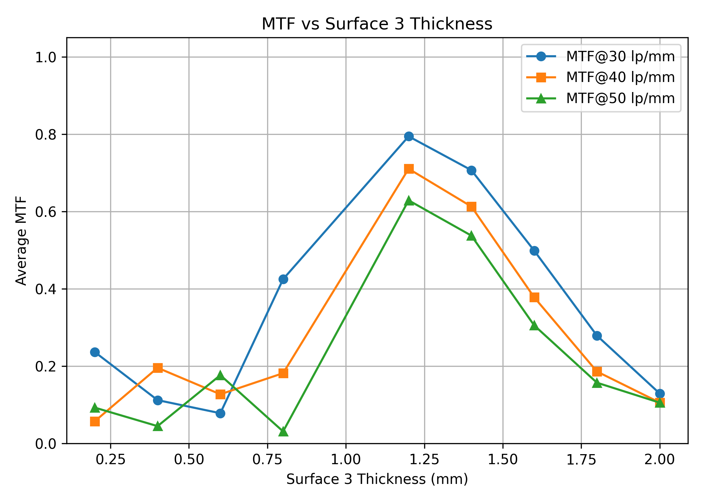
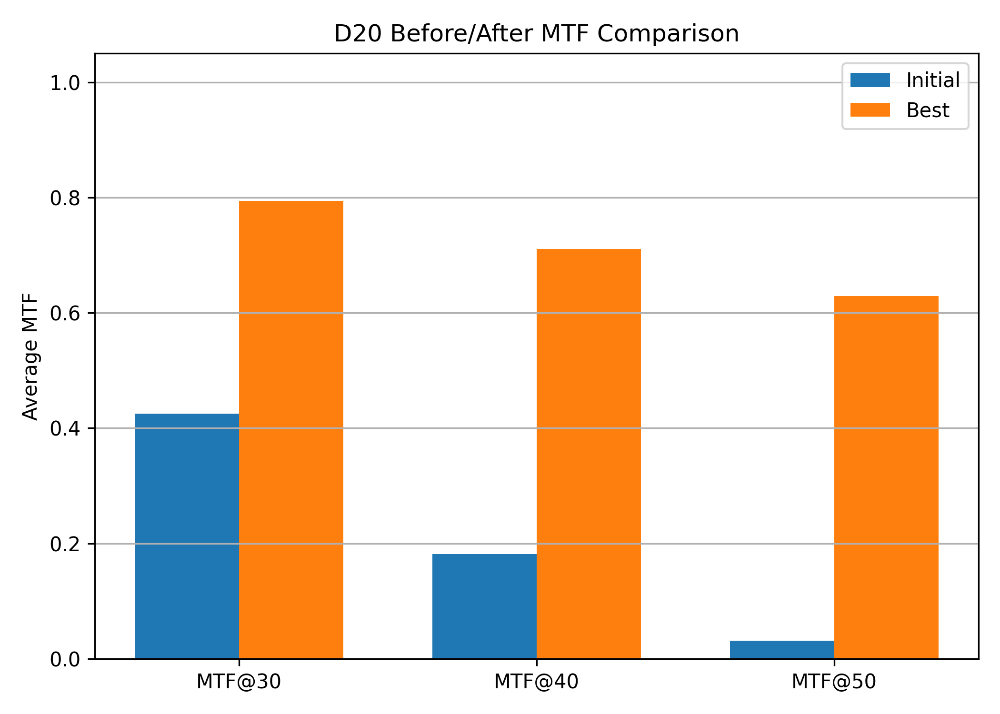

# Zemax ZOS-API 自动化参数扫描与性能评估

## 1. 项目简介

本项目基于 Python 与 Zemax ZOS-API，搭建了一个面向光学系统的自动化参数扫描与性能评估流程。项目以 Zemax 示例镜头 `Cooke 40 degree field.zmx` 为对象，选择 LDE 中 `Surface 3 Thickness` 作为扫描参数，实现了模型读取、参数修改、批量分析导出、MTF 指标提取、性能曲线绘制、评分筛选和 before-after 对比。

项目目标是将传统手动仿真流程转化为可重复、可批量、可评价的自动化流程。

---

## 2. 技术路线

```text
Zemax 示例镜头
↓
Python/ZOS-API 连接 OpticStudio
↓
读取 LDE 表面参数
↓
循环修改 Surface 3 Thickness
↓
导出每组 zmx / LDE CSV / FFT MTF txt / Spot txt
↓
提取 MTF@30/40/50
↓
生成 sweep_results.csv
↓
绘制 MTF_vs_thickness 曲线
↓
构建 MTF-only 评分函数
↓
输出 best_design.json
↓
整理 before-after 对比结果
```

---

## 3. 项目结构

```text
02_zosapi_python/
├─ configs/
│  ├─ config_D15_cooke_thickness.yaml
│  └─ config_D16_cooke_thickness_sweep.yaml
├─ scripts/
│  ├─ zemax_runner.py
│  ├─ D16_sweep_thickness.py
│  ├─ D17_extract_mtf_metrics.py
│  ├─ D18_plot_mtf_vs_thickness.py
│  ├─ D19_select_best_design.py
│  └─ D20_prepare_before_after.py
├─ results/
│  ├─ D16_thickness_sweep/
│  ├─ D17_metric_extraction/
│  ├─ D18_mtf_plots/
│  ├─ D19_best_design/
│  └─ D20_before_after/
├─ figures/
├─ notes/
├─ docs/
├─ reports/
└─ README.md
```

---

## 4. 主要脚本说明

### `scripts/zemax_runner.py`

封装可复用的 Zemax 操作函数，包括：

- 连接 OpticStudio；
- 打开 Zemax 镜头文件；
- 读取和导出 LDE 数据；
- 修改指定表面厚度；
- 保存模型；
- 导出 FFT MTF 分析结果；
- 导出 Standard Spot Diagram 分析结果。

### `scripts/legacy/D16_sweep_thickness.py`

读取 YAML 配置文件，循环修改 `Surface 3 Thickness`，并保存每组模型和分析结果。

主要输出：

```text
results/D16_thickness_sweep/D16_sweep_summary.csv
```

`D16_sweep_summary.csv` 是每个扫描 case 的索引表，记录参数、实际厚度、运行状态以及模型、LDE、MTF、Spot 文件路径。

### `scripts/legacy/D17_extract_mtf_metrics.py`

从 D16 批量导出的 FFT MTF txt 文件中提取 MTF@30/40/50 指标，生成可比较的指标表。

主要输出：

```text
results/D17_metric_extraction/sweep_results.csv
```

### `scripts/legacy/D18_plot_mtf_vs_thickness.py`

读取 D17 的指标表，绘制 MTF 随 Surface 3 Thickness 变化的趋势曲线。

主要输出：

```text
results/D18_mtf_plots/D18_mtf_vs_thickness.png
results/D18_mtf_plots/D18_mtf_vs_delta.png
```

### `scripts/legacy/D19_select_best_design.py`

构建 MTF-only 加权评分函数，筛选当前评分规则下的较优厚度参数。

当前评分函数：

```text
final_score = 0.3*mtf_30_avg + 0.3*mtf_40_avg + 0.4*mtf_50_avg
```

主要输出：

```text
results/D19_best_design/best_design.json
results/D19_best_design/D19_score_vs_thickness.png
```

### `scripts/legacy/D20_prepare_before_after.py`

根据 D19 选择出的最佳 case，整理初始设计和最佳设计的 before-after 对比结果。

主要输出：

```text
results/D20_before_after/D20_before_after_metrics.csv
results/D20_before_after/D20_mtf_before_after_bar.png
```

---

## 5. 结果展示

### 5.1 MTF 随 Surface 3 Thickness 变化



该图用于观察不同厚度下 MTF@30/40/50 的变化趋势。

### 5.2 加权评分随 Surface 3 Thickness 变化


该图展示了当前 MTF-only 评分函数下，不同厚度对应的综合评分。

### 5.3 初始设计与最佳设计对比



该图用于展示初始设计和当前评分规则下最佳设计的 MTF 指标对比。

---

## 6. 当前结果

在当前扫描范围和 MTF-only 评分函数下，Surface 3 Thickness 附近存在一个较优区间。评分曲线显示，较优厚度大约出现在 `1.2 mm` 附近。

需要注意的是，当前结果只代表“在当前 MTF-only 评分函数下的较优厚度”，不能等同于完整光学设计意义上的最终最优设计。

---

## 7. 如何运行

### 7.1 环境要求

- Windows
- Ansys Zemax OpticStudio
- Python 3.8
- ZOS-API / pywin32
- pandas
- matplotlib
- PyYAML

### 7.2 运行顺序

在项目根目录运行：

```powershell
python scripts/legacy/D16_sweep_thickness.py
python scripts/legacy/D17_extract_mtf_metrics.py
python scripts/legacy/D18_plot_mtf_vs_thickness.py
python scripts/legacy/D19_select_best_design.py
python scripts/legacy/D20_prepare_before_after.py
```

注意：需要在项目根目录运行，例如：

```powershell
C:\Users\20181\Desktop\Zemax\02_zosapi_python>
```

不要进入 `scripts` 文件夹内部运行。

---

## 8. 核心理解

### 8.1 YAML 配置文件的作用

`.yaml` 文件相当于任务说明书，用来记录模型路径、扫描表面、扫描范围、步长和输出目录。这样后续修改扫描范围或目标表面时，可以优先修改配置文件，而不是频繁改主程序代码。

### 8.2 `zemax_runner.py` 的作用

`zemax_runner.py` 是工具箱，负责封装可复用的 Zemax 操作函数。后续的 D16、D17、D18、D19、D20 脚本不需要重复定义连接、打开模型、导出分析等底层操作，而是直接调用这些函数或读取前一步生成的结果。

### 8.3 参数扫描的关键原则

参数扫描时不能一直在当前厚度基础上累加，否则厚度会不断偏离。正确做法是：

```text
actual_thickness = original_thickness + delta
```

也就是每一组扫描都基于原始厚度计算实际厚度。

### 8.4 before-after 对比的定义

- before：初始设计，即 `delta_mm` 最接近 0 的 case；
- after：D19 根据当前评分函数筛选出的最佳 case。

before 不是最差结果，而是用于代表原始设计的基准结果。

---

## 9. 当前局限

1. 当前评分函数是 MTF-only 版本，尚未加入 RMS Spot、焦距、畸变等指标。
2. 当前 MTF 指标来自 txt 文件解析，后续更严谨的方式是直接从 ZOS-API DataSeries 中提取。
3. 当前 MTF 使用多条曲线平均值，尚未区分不同视场和 Tangential/Sagittal 方向。
4. 当前只扫描了一个参数，后续可以扩展到多个关键结构参数。
5. 当前扫描步长为固定步长，不能保证得到全局最优结果。
6. 当前结果只能表述为“当前评分规则下的较优设计”，不能称为完整意义上的最终最优光学设计。

---

## 10. 后续计划

- 加入 RMS Spot 指标；
- 区分不同视场和 Tangential/Sagittal 方向；
- 在较优厚度附近进行更小步长二次扫描；
- 将扫描、评价、绘图和报告生成整合到统一主程序；
- 尝试让 AI 根据自然语言需求生成 JSON/YAML 扫描配置；
- 后续扩展到 COMSOL 参数化光场/散射仿真。

---

## 11. 项目收获

通过本项目，我初步掌握了使用 Python/ZOS-API 控制 Zemax 的自动化流程，理解了从单次仿真到批量参数扫描、从分析结果导出到指标提取、从曲线绘制到最优参数筛选的完整工程链路。

相比手动仿真，该流程具有更好的重复性、可追溯性和扩展性，为后续引入更复杂评分函数、COMSOL 参数化仿真以及 AI Agent 生成配置文件打下基础。

---

## D22-D27 自动化工作流阶段说明

本阶段完成了 Zemax 自动化项目的工程化重构，主要目标是将前期零散脚本整理为配置文件驱动的一键运行流程。

当前 workflow 支持：

- 读取 `configs/config_zemax.yaml`
- 根据配置生成扫描参数列表
- 自动创建 `results/YYYYMMDD_task/` 结果目录
- 自动备份本次配置文件
- 自动生成运行日志 `run.log`
- 自动生成扫描结果 CSV 和运行状态 CSV
- 自动绘制 MTF_50 曲线图
- 自动生成 Markdown 报告草稿 `report.md`

当前阶段仍为 dry-run demo，尚未真正调用 Zemax ZOS-API。后续需要将 `workflow_runner.py` 中的模拟指标生成函数替换为真实 Zemax API 调用函数。


## 第 5 周：AI Agent 低配版

## D29：明确 AI Agent 在 Zemax 自动化项目中的定位
  - [Agent Positioning](docs/D29_agent_positioning.md)
  - [Natural Language Task Template](docs/natural_language_task_template.md)
  - [Agent Boundary](docs/agent_boundary.md)
  - [Example Natural Language Tasks](examples/tasks/D29_example_tasks.md)
  

  ## D30：自然语言转 YAML，并使用 JSON Schema 校验

本阶段将自然语言 Zemax 自动化需求转化为 YAML 任务文件，并使用 JSON Schema 对字段、类型、单位、输出路径和安全约束进行校验。

主要文件：

- `configs/task_schema.json`：任务结构和安全边界规则
- `configs/agent_tasks/D30_task_example.yaml`：AI 生成的 YAML 任务示例
- `examples/tasks/D30_natural_language_request.md`：自然语言原始需求
- `scripts/validation/D30_validate_task_yaml.py`：YAML 任务校验脚本
- `docs/D30_natural_language_to_yaml.md`：D30 学习说明

## D31：YAML 调用脚本

本阶段实现从 AI 生成的 YAML 任务文件到 Python 脚本输入的转换流程。

主要文件：

- `scripts/agent/D31_run_from_task_yaml.py`：读取、校验、预览 YAML 任务，并生成 workflow 配置
- `configs/agent_tasks/D30_task_example.yaml`：AI 生成的 YAML 任务示例
- `configs/task_schema.json`：任务 schema 校验规则
- `configs/config_D31_from_task.yaml`：由 D31 脚本自动生成的工作流配置

当前阶段默认 dry-run，不直接运行 Zemax，避免 AI 任务未经确认就修改模型。


## D32：结果自动总结

本阶段完成了结果自动总结流程。脚本可以根据 D31 生成的工作流配置，自动查找结果目录中的 CSV、图像、JSON 和日志，并生成 `reports/workflow/D32_result_summary_input.md` 作为 AI 总结材料。

当前结果目录中尚未检测到真实仿真输出，因此 D32 总结只记录流程状态和缺失信息，不编造 MTF、RMS Spot 或最优参数结论。

## D33：安全边界

本阶段为 AI 生成的 Zemax 自动化任务增加安全检查。

主要文件：

- `configs/safety_policy.yaml`：项目级安全策略
- `modules/task_safety.py`：安全检查函数库
- `scripts/validation/D33_check_task_safety.py`：D33 安全检查入口脚本
- `docs/D33_safety_boundary.md`：D33 学习说明

当前检查内容包括参数范围、单位、扫描次数、输出路径、只读模型和 dry-run 原则。任何 AI 生成任务在进入 Zemax 自动化执行前，都必须先通过 D33 安全检查。

## D34：Agent Demo 演示

本阶段完成低配版 AI Agent 工作流 demo。

当前 demo 的准确流程为：

自然语言需求 → ChatGPT/人工生成 YAML 任务 → Schema 校验 → Safety Policy 校验 → D31 workflow config 生成 → D32 结果总结材料生成 → D34 demo 报告生成

主要文件：

- `examples/tasks/D30_natural_language_request.md`：自然语言需求记录
- `prompts/nl_to_yaml_prompt.md`：自然语言转 YAML 的提示词模板
- `configs/agent_tasks/D30_task_example.yaml`：由 ChatGPT/人工生成的 YAML 任务
- `scripts/agent/D34_agent_demo.py`：Agent demo 总控脚本
- `reports/D34_agent_demo_report.md`：D34 自动生成的 demo 报告
- `docs/D34_natural_language_gap.md`：当前自然语言识别缺口说明

当前版本中，Python 并不会直接理解自然语言；自然语言到 YAML 的转换暂时由 ChatGPT/人工完成。Python 从 YAML 开始接管，负责结构校验、安全校验、工作流配置生成和结果总结材料生成。