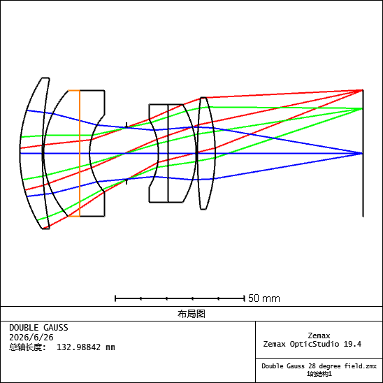
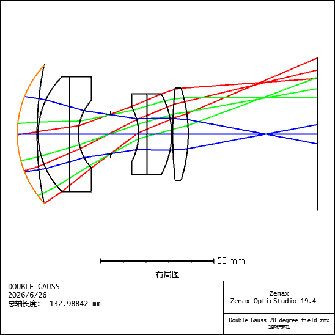
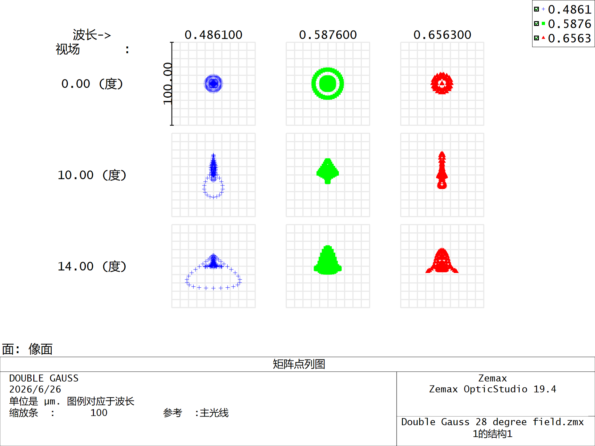
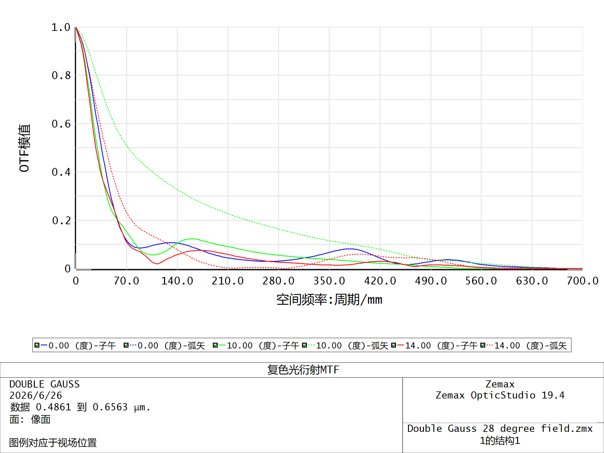
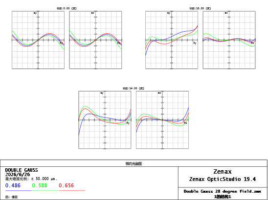
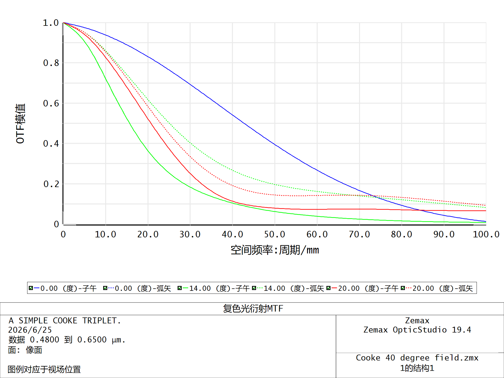
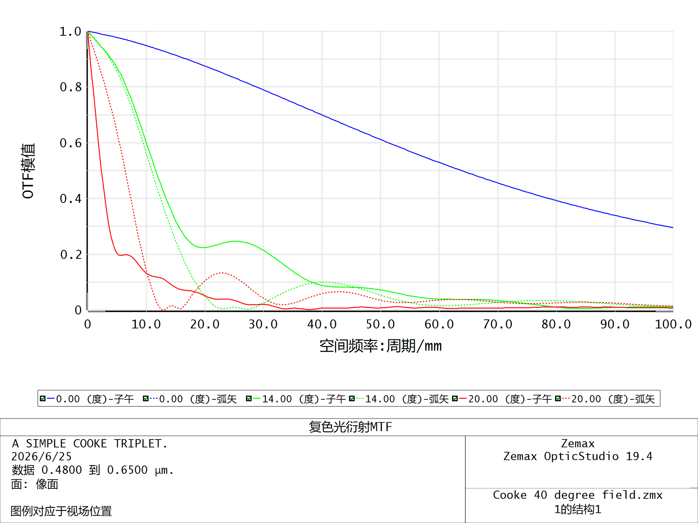

# zemax-python-learning
Learning notes and scripts for Zemax ZOS-API, Python automation, and optical simulation.

This repository records my learning notes and Python scripts for Zemax ZOS-API automation.

## Contents

- Zemax ZOS-API Python examples
- Lens data reading and exporting
- MTF analysis and data visualization
- Weekly learning logs

## Learning Progress

- Week 1: Python environment and ZOS-API connection
- Week 2: Reading lens data and exporting analysis results

## Tools

- Python
- Zemax OpticStudio
- ZOS-API
- GitHub


# Zemax 手动建模与性能评价练习（第一部分）

## 1. 项目目标

本项目用于记录 Zemax OpticStudio 顺序模式下的基础学习过程，重点包括镜头结构读取、参数修改、性能评价图导出和简单优化流程。通过 Double Gauss 和 Cooke Triplet 官方示例，理解 LDE、System Explorer、Field、Wavelength、Aperture、Spot Diagram、FFT MTF、Ray Fan 和 Merit Function 等基础概念。

## 2. 使用模型

* Double Gauss 28 degree field
* Cooke 40 degree field

## 3. 学习内容

* 读取 Lens Data Editor 中的 Radius、Thickness、Glass、Semi-Diameter 等参数
* 理解 Field、Wavelength、Aperture、Stop 和 Image Surface 的作用
* 导出 Layout、Spot Diagram、FFT MTF、Ray Fan、RMS vs Field 等分析图
* 手动修改 Thickness 或 Radius，观察光路、Spot 和 MTF 的变化
* 学习 Variable、Merit Function、Operand、Constraint 和局部优化流程
* 对比 Cooke Triplet 原始、扰动后和优化后的 MTF 曲线

## 4. 关键结果图

### 4.1 光路结构



### 4.2 参数修改后光路变化



### 4.3 Spot Diagram



Spot Diagram 用于观察像面处光线落点分布。光斑越集中，说明聚焦越好；边缘视场出现拉伸、彗尾或三角形分布，通常说明离轴像差增强。

### 4.4 FFT MTF



MTF 用于评价成像系统对不同空间频率细节的传递能力。MTF 曲线越高，说明图像细节和对比度保留越好。评价时不能只看中心视场，还需要关注边缘视场、Tangential/Sagittal 分离和目标空间频率处的表现。

### 4.5 Ray Fan



Ray Fan 用于观察不同孔径位置光线相对于理想像点的偏差。曲线越接近 0，说明像差越小；曲线明显弯曲或 T/S 差异明显，说明系统存在离轴像差或方向性像差。

### 4.6 Cooke Triplet MTF 对比






通过 Cooke Triplet 示例可以看到，手动改变像面位置或表面参数后，边缘视场 MTF 可能明显下降；通过重新优化或恢复参数，MTF 可以接近原始状态。

## 5. 本周总结

本周完成了 Zemax 顺序模式下的基础镜头分析流程。通过 Double Gauss 和 Cooke Triplet 示例，初步掌握了 LDE 参数读取、系统孔径/视场/波长设置、Spot Diagram、FFT MTF 和 Ray Fan 的基本读图方法。重点理解了 RMS 类指标越小越好，MTF 越高越好，T/S 分离越小越好。通过手动修改参数和简单优化，理解了镜头参数变化对焦点位置、离轴像差和成像质量的影响。

## 6. 下一步计划

下一阶段将学习 ZOS-API / Python 自动化，目标是实现 Python 连接 Zemax、读取 LDE 参数、修改指定表面参数，并自动导出 MTF 或 Spot 分析结果。


# Zemax ZOS-API 自动化参数扫描与性能评估（第二部分）

## 1. 项目简介

本项目基于 Python 与 Zemax ZOS-API，搭建了一个面向光学系统的自动化参数扫描与性能评估流程。项目以 Zemax 示例镜头 `Cooke 40 degree field.zmx` 为对象，选择 LDE 中 `Surface 3 Thickness` 作为扫描参数，实现了模型读取、参数修改、批量分析导出、MTF 指标提取、性能曲线绘制、评分筛选和 before-after 对比。

项目目标是将传统手动仿真流程转化为可重复、可批量、可评价的自动化流程。

---

## 2. 技术路线

```text
Zemax 示例镜头
↓
Python/ZOS-API 连接 OpticStudio
↓
读取 LDE 表面参数
↓
循环修改 Surface 3 Thickness
↓
导出每组 zmx / LDE CSV / FFT MTF txt / Spot txt
↓
提取 MTF@30/40/50
↓
生成 sweep_results.csv
↓
绘制 MTF_vs_thickness 曲线
↓
构建 MTF-only 评分函数
↓
输出 best_design.json
↓
整理 before-after 对比结果
```

---

## 3. 项目结构

```text
02_zosapi_python/
├─ configs/
│  ├─ config_D15_cooke_thickness.yaml
│  └─ config_D16_cooke_thickness_sweep.yaml
├─ scripts/
│  ├─ zemax_runner.py
│  ├─ D16_sweep_thickness.py
│  ├─ D17_extract_mtf_metrics.py
│  ├─ D18_plot_mtf_vs_thickness.py
│  ├─ D19_select_best_design.py
│  └─ D20_prepare_before_after.py
├─ results/
│  ├─ D16_thickness_sweep/
│  ├─ D17_metric_extraction/
│  ├─ D18_mtf_plots/
│  ├─ D19_best_design/
│  └─ D20_before_after/
├─ figures/
├─ notes/
├─ docs/
├─ reports/
└─ README.md
```

---

## 4. 主要脚本说明

### `scripts/zemax_runner.py`

封装可复用的 Zemax 操作函数，包括：

- 连接 OpticStudio；
- 打开 Zemax 镜头文件；
- 读取和导出 LDE 数据；
- 修改指定表面厚度；
- 保存模型；
- 导出 FFT MTF 分析结果；
- 导出 Standard Spot Diagram 分析结果。

### `scripts/D16_sweep_thickness.py`

读取 YAML 配置文件，循环修改 `Surface 3 Thickness`，并保存每组模型和分析结果。

主要输出：

```text
results/D16_thickness_sweep/D16_sweep_summary.csv
```

`D16_sweep_summary.csv` 是每个扫描 case 的索引表，记录参数、实际厚度、运行状态以及模型、LDE、MTF、Spot 文件路径。

### `scripts/D17_extract_mtf_metrics.py`

从 D16 批量导出的 FFT MTF txt 文件中提取 MTF@30/40/50 指标，生成可比较的指标表。

主要输出：

```text
results/D17_metric_extraction/sweep_results.csv
```

### `scripts/D18_plot_mtf_vs_thickness.py`

读取 D17 的指标表，绘制 MTF 随 Surface 3 Thickness 变化的趋势曲线。

主要输出：

```text
results/D18_mtf_plots/D18_mtf_vs_thickness.png
results/D18_mtf_plots/D18_mtf_vs_delta.png
```

### `scripts/D19_select_best_design.py`

构建 MTF-only 加权评分函数，筛选当前评分规则下的较优厚度参数。

当前评分函数：

```text
final_score = 0.3*mtf_30_avg + 0.3*mtf_40_avg + 0.4*mtf_50_avg
```

主要输出：

```text
results/D19_best_design/best_design.json
results/D19_best_design/D19_score_vs_thickness.png
```

### `scripts/D20_prepare_before_after.py`

根据 D19 选择出的最佳 case，整理初始设计和最佳设计的 before-after 对比结果。

主要输出：

```text
results/D20_before_after/D20_before_after_metrics.csv
results/D20_before_after/D20_mtf_before_after_bar.png
```

---

## 5. 结果展示

### 5.1 MTF 随 Surface 3 Thickness 变化


该图用于观察不同厚度下 MTF@30/40/50 的变化趋势。

### 5.2 加权评分随 Surface 3 Thickness 变化


该图展示了当前 MTF-only 评分函数下，不同厚度对应的综合评分。

### 5.3 初始设计与最佳设计对比


该图用于展示初始设计和当前评分规则下最佳设计的 MTF 指标对比。

---

## 6. 当前结果

在当前扫描范围和 MTF-only 评分函数下，Surface 3 Thickness 附近存在一个较优区间。评分曲线显示，较优厚度大约出现在 `1.2 mm` 附近。

需要注意的是，当前结果只代表“在当前 MTF-only 评分函数下的较优厚度”，不能等同于完整光学设计意义上的最终最优设计。

---

## 7. 如何运行

### 7.1 环境要求

- Windows
- Ansys Zemax OpticStudio
- Python 3.8
- ZOS-API / pywin32
- pandas
- matplotlib
- PyYAML

### 7.2 运行顺序

在项目根目录运行：

```powershell
python scripts/D16_sweep_thickness.py
python scripts/D17_extract_mtf_metrics.py
python scripts/D18_plot_mtf_vs_thickness.py
python scripts/D19_select_best_design.py
python scripts/D20_prepare_before_after.py
```

注意：需要在项目根目录运行，例如：

```powershell
C:\Users\20181\Desktop\Zemax\02_zosapi_python>
```

不要进入 `scripts` 文件夹内部运行。

---

## 8. 核心理解

### 8.1 YAML 配置文件的作用

`.yaml` 文件相当于任务说明书，用来记录模型路径、扫描表面、扫描范围、步长和输出目录。这样后续修改扫描范围或目标表面时，可以优先修改配置文件，而不是频繁改主程序代码。

### 8.2 `zemax_runner.py` 的作用

`zemax_runner.py` 是工具箱，负责封装可复用的 Zemax 操作函数。后续的 D16、D17、D18、D19、D20 脚本不需要重复定义连接、打开模型、导出分析等底层操作，而是直接调用这些函数或读取前一步生成的结果。

### 8.3 参数扫描的关键原则

参数扫描时不能一直在当前厚度基础上累加，否则厚度会不断偏离。正确做法是：

```text
actual_thickness = original_thickness + delta
```

也就是每一组扫描都基于原始厚度计算实际厚度。

### 8.4 before-after 对比的定义

- before：初始设计，即 `delta_mm` 最接近 0 的 case；
- after：D19 根据当前评分函数筛选出的最佳 case。

before 不是最差结果，而是用于代表原始设计的基准结果。

---

## 9. 当前局限

1. 当前评分函数是 MTF-only 版本，尚未加入 RMS Spot、焦距、畸变等指标。
2. 当前 MTF 指标来自 txt 文件解析，后续更严谨的方式是直接从 ZOS-API DataSeries 中提取。
3. 当前 MTF 使用多条曲线平均值，尚未区分不同视场和 Tangential/Sagittal 方向。
4. 当前只扫描了一个参数，后续可以扩展到多个关键结构参数。
5. 当前扫描步长为固定步长，不能保证得到全局最优结果。
6. 当前结果只能表述为“当前评分规则下的较优设计”，不能称为完整意义上的最终最优光学设计。

---

## 10. 后续计划

- 加入 RMS Spot 指标；
- 区分不同视场和 Tangential/Sagittal 方向；
- 在较优厚度附近进行更小步长二次扫描；
- 将扫描、评价、绘图和报告生成整合到统一主程序；
- 尝试让 AI 根据自然语言需求生成 JSON/YAML 扫描配置；
- 后续扩展到 COMSOL 参数化光场/散射仿真。

---

## 11. 项目收获

通过本项目，我初步掌握了使用 Python/ZOS-API 控制 Zemax 的自动化流程，理解了从单次仿真到批量参数扫描、从分析结果导出到指标提取、从曲线绘制到最优参数筛选的完整工程链路。

相比手动仿真，该流程具有更好的重复性、可追溯性和扩展性，为后续引入更复杂评分函数、COMSOL 参数化仿真以及 AI Agent 生成配置文件打下基础。

---