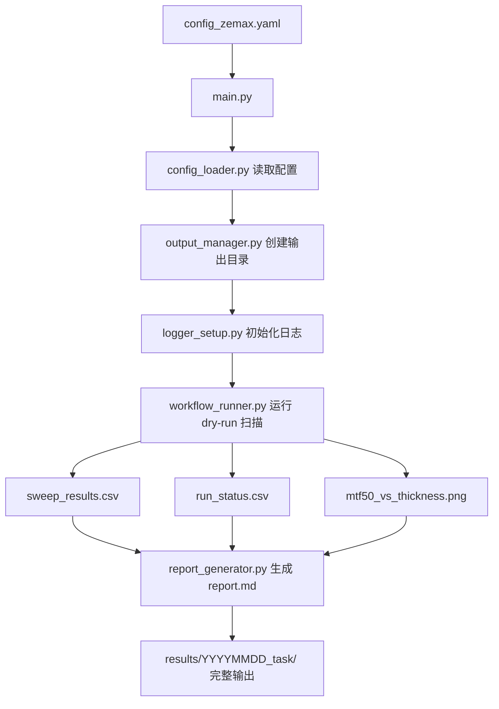

# D22-D27 Zemax 自动化工作流架构说明

## 1. 本周目标

本周的目标不是继续增加 Zemax 仿真功能，而是把前面已经跑通的零散脚本整理成一个可以长期维护的自动化项目结构。

核心变化是：

- 从手动改 Python 脚本，变成修改 `config_zemax.yaml`
- 从手动创建结果文件夹，变成自动生成 `results/YYYYMMDD_task/`
- 从手动记录运行过程，变成自动生成 `logs/run.log`
- 从手动整理结果，变成自动生成 CSV、图像和 Markdown 报告
- 从单个脚本实验，变成模块化 workflow

## 2. 当前工作流



## 3. 各文件作用

| 文件 | 作用 |
|---|---|
| `main.py` | 项目统一入口，负责按顺序调用各模块 |
| `configs/config_zemax.yaml` | 保存任务参数、扫描范围、输出路径等配置 |
| `modules/config_loader.py` | 读取 YAML 配置，并生成扫描参数列表 |
| `modules/output_manager.py` | 自动创建本次运行的结果目录和子文件夹 |
| `modules/logger_setup.py` | 初始化日志系统，生成 `run.log` |
| `modules/workflow_runner.py` | 当前用于 dry-run 模拟扫描，后续替换成真实 Zemax 调用 |
| `modules/report_generator.py` | 自动生成 Markdown 报告草稿 |
| `modules/zemax_runner.py` | 后续放真实 ZOS-API 连接、修改参数和导出分析结果函数 |
| `modules/result_analyzer.py` | 后续放真实 CSV 分析、评分和最优参数筛选函数 |

## 4. 当前输出内容

每次运行：

```bash
python main.py
```

会自动生成：

```text
results/YYYYMMDD_task/
├─ csv/
│  ├─ sweep_results.csv
│  └─ run_status.csv
├─ figures/
│  └─ mtf50_vs_thickness.png
├─ logs/
│  └─ run.log
├─ reports/
│  └─ report.md
└─ config_used.yaml
```

## 5. 当前阶段的局限

当前 D27 完成的是 dry-run workflow，也就是用模拟数据代替真实 Zemax 结果。

因此：

- `MTF_50` 不是 Zemax 真实计算值
- `RMS_Spot` 不是真实 Spot Diagram 提取值
- `mtf50_vs_thickness.png` 是流程测试图，不是最终科研结果图
- 后续需要把 `workflow_runner.py` 中的模拟函数替换为真实 `zemax_runner.py` 调用

## 6. 下一步如何接入真实 Zemax

后续真正接 Zemax 时，逻辑应该是：

```text
workflow_runner.py
    ↓ 调用
zemax_runner.py
    ↓ 完成
打开 Zemax 模型
修改指定表面参数
运行 MTF / Spot 分析
导出真实结果
保存 CSV / 图片 / 模型
```

也就是说，D22-D27 做的是“工程框架”，后面只需要把 dry-run 的模拟部分替换成真实 Zemax API 调用。