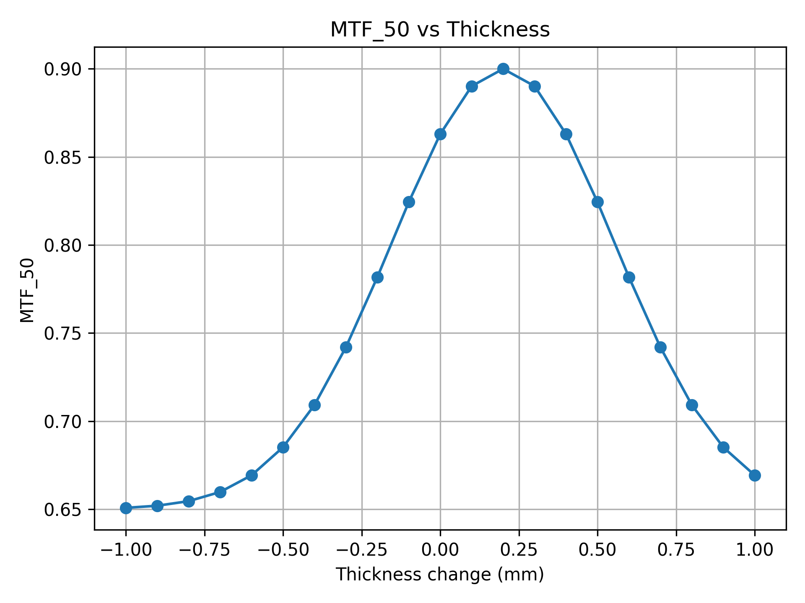

# Zemax 参数扫描自动化报告草稿

## 1. 项目信息

| 项目 | 内容 |
|---|---|
| 项目名称 | zemax_thickness_sweep_demo |
| 项目说明 | D23 配置文件驱动测试 |
| 生成时间 | 2026-07-03 16:30:39 |
| Dry Run | True |

## 2. Zemax 模型信息

| 项目 | 内容 |
|---|---|
| Zemax 运行模式 | standalone |
| 模型文件 | `models/Double_Gauss_28_degree_field.zmx` |
| 是否保存模型 | True |

## 3. 参数扫描设置

| 项目 | 内容 |
|---|---|
| 扫描表面 | Surface 6 |
| 扫描参数 | thickness |
| 单位 | mm |
| 起始值 | -1.0 |
| 终止值 | 1.0 |
| 步长 | 0.1 |
| 扫描点数量 | 21 |

### 扫描值列表

-1.0, -0.9, -0.8, -0.7, -0.6, -0.5, -0.4, -0.3, -0.2, -0.1, -0.0, 0.1, 0.2, 0.3, 0.4, 0.5, 0.6, 0.7, 0.8, 0.9, 1.0

## 4. 评价指标

- MTF_30
- MTF_50
- RMS_Spot

## 5. 输出文件结构

| 类型 | 路径 |
|---|---|
| 本次运行目录 | `C:\Users\20181\Desktop\Zemax\02_zosapi_python\results\20260703_zemax_thickness_sweep_demo` |
| CSV 目录 | `C:\Users\20181\Desktop\Zemax\02_zosapi_python\results\20260703_zemax_thickness_sweep_demo\csv` |
| 图片目录 | `C:\Users\20181\Desktop\Zemax\02_zosapi_python\results\20260703_zemax_thickness_sweep_demo\figures` |
| 模型目录 | `C:\Users\20181\Desktop\Zemax\02_zosapi_python\results\20260703_zemax_thickness_sweep_demo\models` |
| 日志目录 | `C:\Users\20181\Desktop\Zemax\02_zosapi_python\results\20260703_zemax_thickness_sweep_demo\logs` |
| 报告目录 | `C:\Users\20181\Desktop\Zemax\02_zosapi_python\results\20260703_zemax_thickness_sweep_demo\reports` |
| 配置备份 | `C:\Users\20181\Desktop\Zemax\02_zosapi_python\results\20260703_zemax_thickness_sweep_demo\config_used.yaml` |

## 6. 实际输出文件

| 文件类型 | 文件路径 |
|---|---|
| 扫描结果 CSV | `C:\Users\20181\Desktop\Zemax\02_zosapi_python\results\20260703_zemax_thickness_sweep_demo\csv\sweep_results.csv` |
| 运行状态 CSV | `C:\Users\20181\Desktop\Zemax\02_zosapi_python\results\20260703_zemax_thickness_sweep_demo\csv\run_status.csv` |
| MTF_50 曲线图 | `C:\Users\20181\Desktop\Zemax\02_zosapi_python\results\20260703_zemax_thickness_sweep_demo\figures\mtf50_vs_thickness.png` |
| 日志文件 | `C:\Users\20181\Desktop\Zemax\02_zosapi_python\results\20260703_zemax_thickness_sweep_demo\logs\run.log` |
| 报告文件 | `C:\Users\20181\Desktop\Zemax\02_zosapi_python\results\20260703_zemax_thickness_sweep_demo\reports\report.md` |

## 7. 自动生成图表

本次 workflow 自动生成了 MTF_50 随扫描参数变化的曲线：

## 8. 当前最优结果

当前 dry-run demo 中，score 最高的参数值为 `0.2 mm`，对应 MTF_50 = `0.9`，RMS_Spot = `8.0`，score = `0.74`。

## 9. 当前说明

本报告由 `report_generator.py` 自动生成。  
当前 D27 阶段完成的是 dry-run 端到端 demo，还没有真正调用 Zemax ZOS-API。

后续接入真实 Zemax 后，需要把 `workflow_runner.py` 中的模拟指标替换为真实的：

- 参数修改
- MTF 分析
- RMS Spot 提取
- 模型保存
- 图像导出

## 10. 当前结论

当前 D27 阶段已经实现：

1. 一条命令读取配置文件；
2. 自动创建本次运行目录；
3. 自动生成 CSV；
4. 自动绘制 MTF_50 曲线；
5. 自动记录日志；
6. 自动生成 Markdown 报告。

